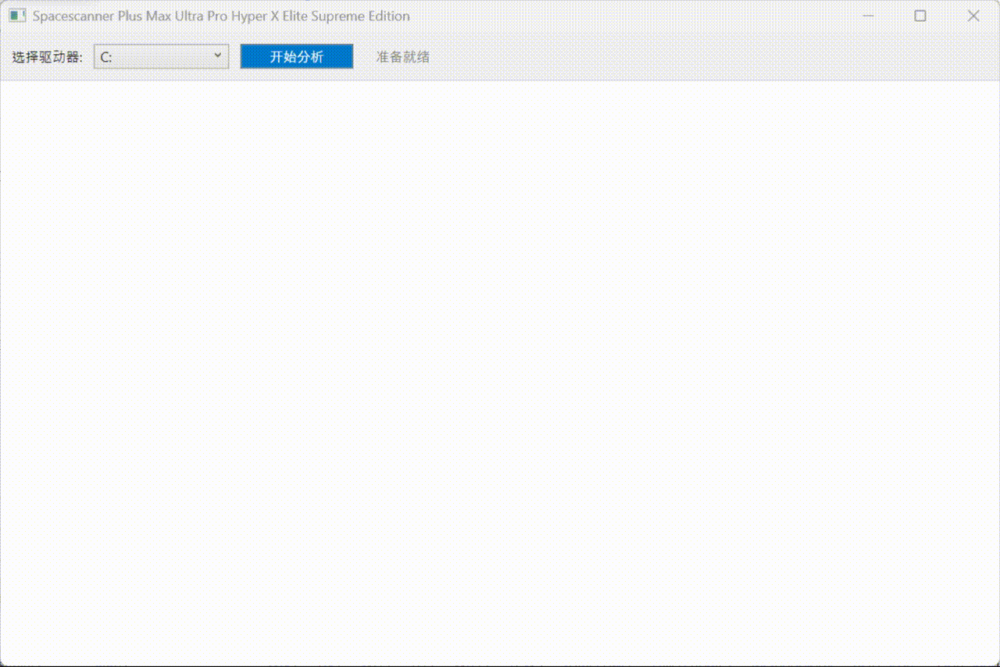
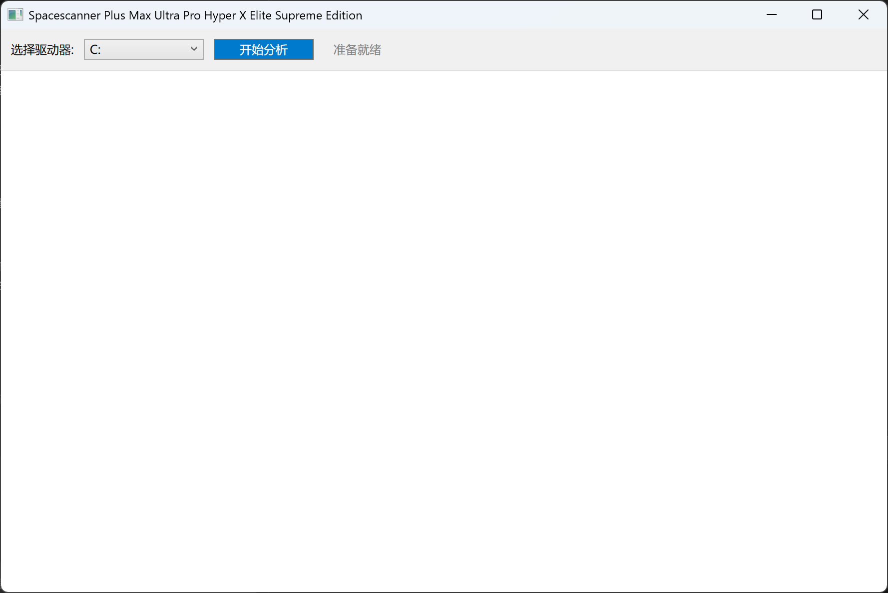
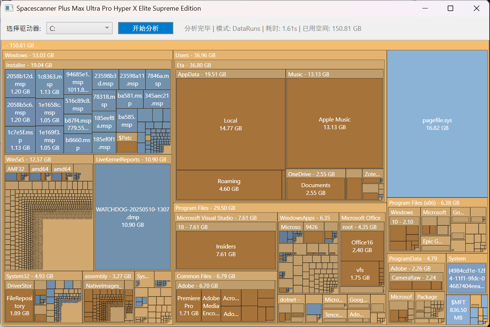

# SpaceScanner

基于 NTFS MFT 的磁盘空间分析工具（WPF + C++ 引擎）。

## 功能

- 可视化显示磁盘空间占用（Treemap）
- 支持目录钻取、返回上级、右键打开路径
- C++ 引擎扫描 NTFS 元数据，C# UI 负责可视化
- 扫描状态会显示引擎模式：
  - `DataRuns`（高速路径）
  - `RecordIoctlFallback`（兼容回退路径）

## 效果展示

<p align="center">
  
</p>

<table>
  <tr>
    <td align="center" width="50%">
      
      <br />
      <sub><b>主界面</b></sub>
    </td>
    <td align="center" width="50%">
      
      <br />
      <sub><b>扫描结果</b></sub>
    </td>
  </tr>
</table>

## 环境要求

- Windows 10/11
- Visual Studio 2022
- 工作负载：
  - `Desktop development with C++`
  - `.NET desktop development`
- .NET SDK 8

## 快速构建（推荐）

在仓库根目录执行：

```powershell
.\publish.ps1 -Configuration Release -Runtime win-x64 -Deployment framework-dependent
```

输出目录：

`SpaceScannerUI\publish\win-x64\`

说明：

- `framework-dependent`：不打包 runtime，默认输出单文件 exe；目标机器需已安装 .NET Desktop Runtime 8。
- `self-contained`：打包 runtime，输出单文件 exe，体积会明显增大；目标机器无需预装 .NET。

## 在 Visual Studio 构建

1. 打开 `SpacescannerPro.sln`
2. 选择 `Release | x64`
3. 执行 `Build Solution`

说明：

- 解决方案已配置先编译 `MFT`，再编译 UI
- 生成的 `MftEngine.exe` 会自动放到 `SpaceScannerUI` 并作为嵌入资源打包

## 运行说明

- 必须以管理员身份运行 `spacescanner.exe`（读取 NTFS 元数据需要权限）
- 仅支持扫描 NTFS 分区

## 常见问题

- 扫描慢：观察状态栏模式
  - `DataRuns`：正常高速
  - `RecordIoctlFallback`：兼容模式，速度会明显降低
- 路径打开失败：确认当前扫描盘符和管理员权限

## 目录结构

```text
.
├─ MftEngine/                 # C++ 扫描引擎
├─ SpaceScannerUI/            # WPF 可视化界面
├─ SpacescannerPro.sln        # 解决方案
└─ build.ps1                  # 构建脚本
```
